# 三組 App 多閉環展示操作手冊

這份手冊由 `scripts/app-catalog.mjs` 的 `demoRoutes` 自動產生。每一組都有一條主線與兩條支線；主線給 2-3 分鐘穩定跑通，支線用來回答評審追問。

## 國小隊伍 1 - AI 自動板擦機器人

入口：https://timdirty.github.io/115-campus-ai-demo/app1/
教學頁：https://timdirty.github.io/115-campus-ai-demo/app1-guide.html

### 三位上台分工

- 第一位同學：開場說明教室問題與作品目標，負責把「先保存、再擦除」講清楚。
- 第二位同學：操作拍白板與教師看板，產生白板分析、保存決策並派出主線任務。
- 第三位同學：展示機器人任務、紀錄本、小老師與學習單，回答硬體與備援問題。

### 路線 A 主線：白板拍照閉環

**目的**：把白板照片變成擦除建議，再由老師確認後派機器人執行。

**學生一句話**：我先拍白板，AI 會告訴老師哪裡可以擦，最後機器人留下完成記錄。

**按哪裡**

1. 拍白板或上傳白板樣張。
2. 看本機像素辨識，指出有筆跡的區塊。
3. 老師保存決策，派板擦機器人或模擬任務。
4. 白板區塊出現完成標記，任務 log 留下證據。

**AI / 辨識來源**：瀏覽器 canvas 像素辨識；Gemini 只用來補充說明，沒有 key 也能完成。

**硬體 / 模擬指令**：`ERASE_REGION_A`, `ERASE_REGION_B`, `ERASE_REGION_C`, `EV3_STATUS`, `EV3_STOP`

**成功證據**：像素分析結果、老師決策紀錄、白板 ✓ 覆蓋層、任務 log / bridge ack

**卡關備案**：相機、Gemini、Arduino 或 EV3 任一失敗時，改用白板樣張與模擬 log，仍能展示同一條流程。

**標註截圖清單**

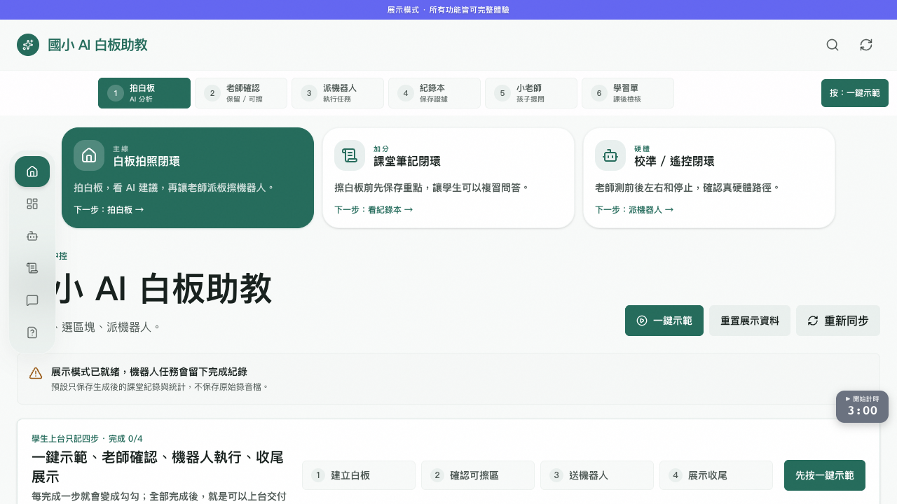

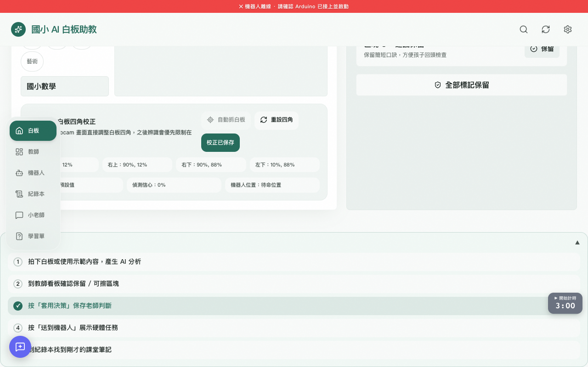

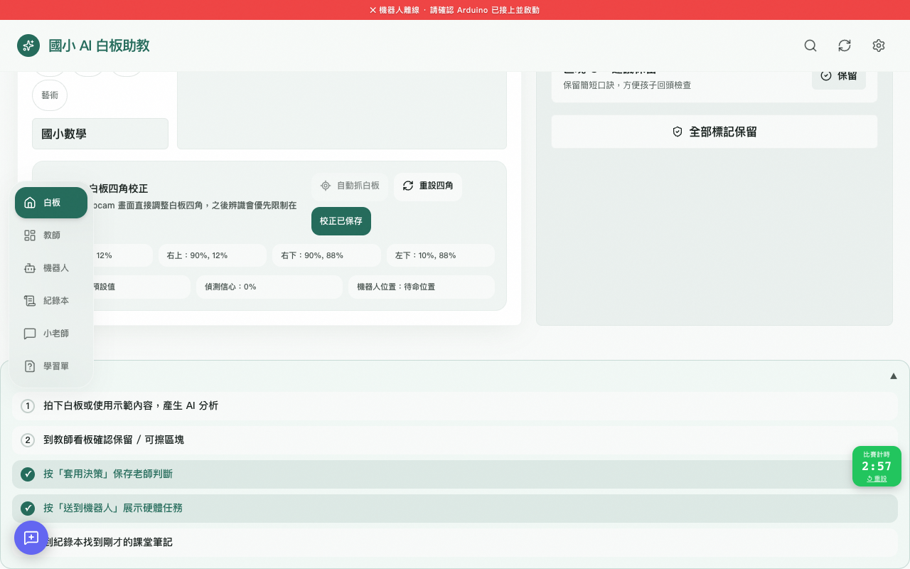

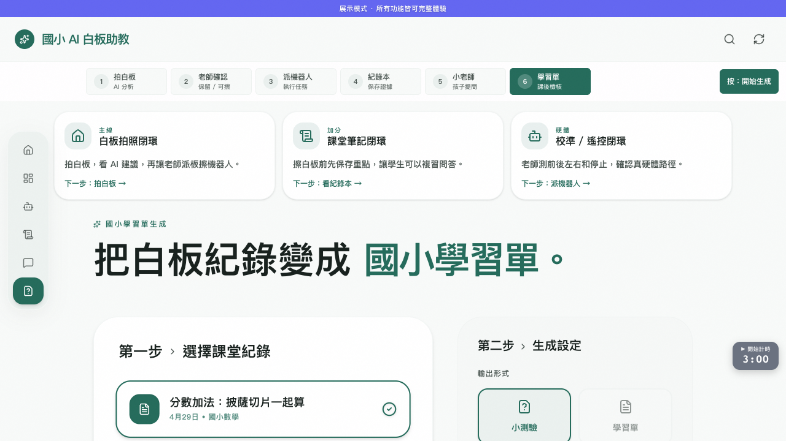

### 路線 B 加分：課堂筆記閉環

**目的**：證明機器人不是只會擦白板，而是先把要保留的學習內容存起來。

**學生一句話**：擦白板前，我會先把今天的重點存成筆記，等一下還能問小老師複習。

**按哪裡**

1. 從白板內容或逐字稿建立課堂重點。
2. AI 把內容整理成學生看得懂的摘要。
3. 存進紀錄本，打開小老師問答。
4. 展示筆記與複習紀錄，證明內容沒有被擦掉。

**AI / 辨識來源**：本機模板摘要加 Gemini 可選文字整理；沒有網路時仍保留筆記與問答入口。

**硬體 / 模擬指令**：`EV3_STATUS`

**成功證據**：課堂摘要、紀錄本資料、小老師問答、匯出或展示紀錄

**卡關備案**：AI 回覆失敗時，使用本機摘要與既有筆記示範保存價值。

**標註截圖清單**

### 路線 C 硬體：校準 / 遙控閉環

**目的**：讓評審看到 App 到 bridge 到 Arduino / EV3 的真硬體路徑。

**學生一句話**：老師先測前後左右和停止，看到 log 回來，才讓機器人去擦白板。

**按哪裡**

1. 老師開啟硬體控制面板。
2. 測試前進、後退、左轉、右轉與停止。
3. 韌體 watchdog 或模擬 log 回報最後指令。
4. 任務面板顯示最後一次硬體動作。

**AI / 辨識來源**：這條路線不靠雲端 AI，重點是控制指令與安全回報。

**硬體 / 模擬指令**：`FORWARD`, `BACKWARD`, `LEFT`, `RIGHT`, `STOP`, `HEARTBEAT`, `EV3_STOP`

**成功證據**：bridge health、最後指令、watchdog / STOP log、任務面板更新

**卡關備案**：真機未接上時打開模擬模式，照樣展示同一批指令與安全停止說法。

**標註截圖清單**

## 國小隊伍 2 - 校園服務機器人

入口：https://timdirty.github.io/115-campus-ai-demo/app2/
教學頁：https://timdirty.github.io/115-campus-ai-demo/app2-guide.html

### 三位上台分工

- 第一位同學：講一句話介紹並按「開始」做影像 / 生活服務任務。
- 第二位同學：按「配送」，完成下單、追蹤到達與 robot display 說明。
- 第三位同學：按「教學 / 生活」，說明點名、事件派遣、報表紀錄與備援。

### 路線 A 主線：福利社配送閉環

**目的**：從學生下單到庫存檢查、機器人派遣、送達確認與報表紀錄。

**學生一句話**：我幫同學下一筆訂單，系統確認有庫存後，機器人就去配送並留下紀錄。

**按哪裡**

1. 學生選商品並送出訂單。
2. 系統檢查庫存，決定是否派遣。
3. Arduino / EV3 / robot display 同步顯示任務狀態。
4. 到達確認後，報表留下完整服務紀錄。

**AI / 辨識來源**：本機規則先做庫存與任務判斷；AI 只用於補貨與派遣說明，沒有 key 也能跑主線。

**硬體 / 模擬指令**：`DISPATCH_DELIVERY`, `EV3_ARM_EXTEND`, `EV3_ARM_RETRACT`, `STOP`

**成功證據**：庫存扣減、訂單紀錄、任務 log、到達時間戳、報表紀錄

**卡關備案**：沒有 Arduino / EV3 時改用模擬派遣與 robot display，保留同樣的任務紀錄。

**標註截圖清單**

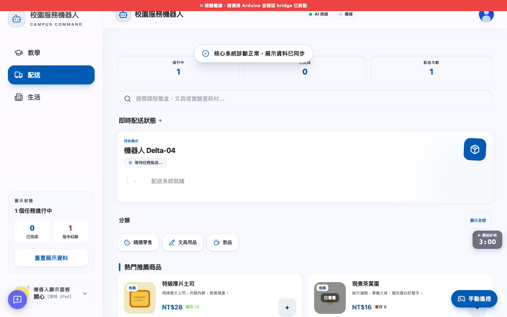

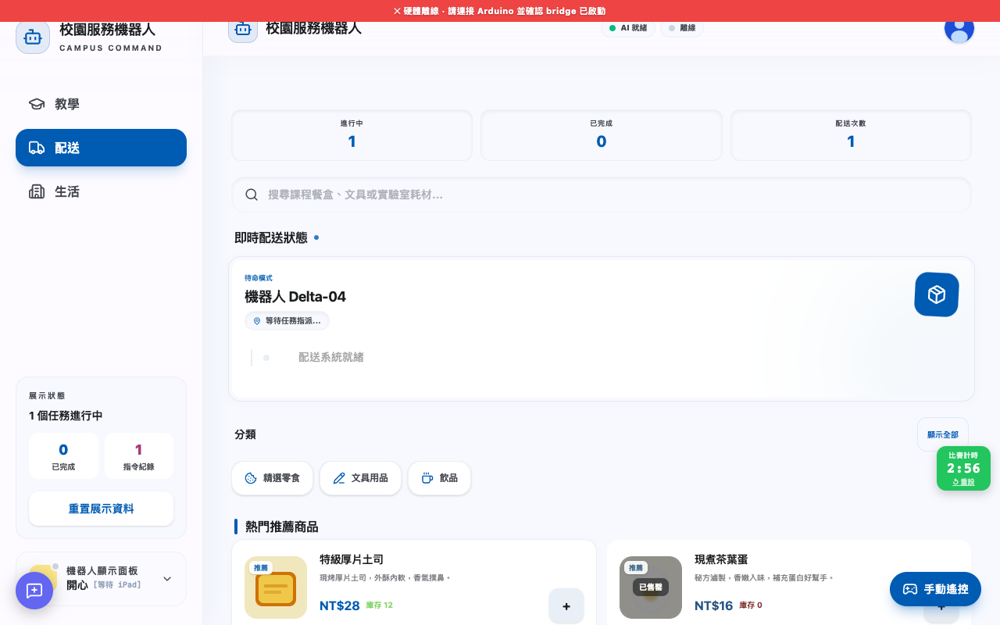

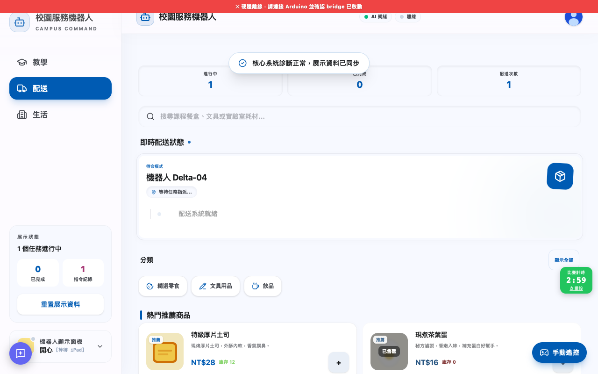

### 路線 B 加分：教學助手閉環

**目的**：把老師點名或提醒變成教學服務任務，並讓機器人狀態同步回報。

**學生一句話**：老師按一次點名，AI 幫忙整理班級狀態，機器人顯示今天要服務的任務。

**按哪裡**

1. 老師啟動點名或課堂提醒。
2. AI / 規則整理班級狀態與待提醒事項。
3. 產生教學服務任務並同步 robot display。
4. 任務完成後寫入報表。

**AI / 辨識來源**：本機班級規則與可選 AI 摘要；斷網時仍能建立教學任務。

**硬體 / 模擬指令**：`TEACH_ATTENDANCE`, `DISPLAY_EMOTION`, `EV3_STATUS`

**成功證據**：點名結果、教學服務任務、robot display 狀態、報表紀錄

**卡關備案**：AI 無回應時以本機點名結果和任務卡完成示範。

**標註截圖清單**

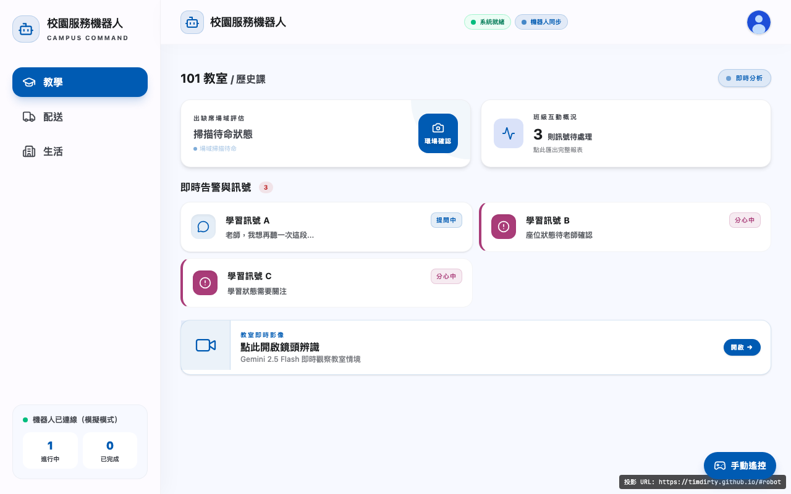

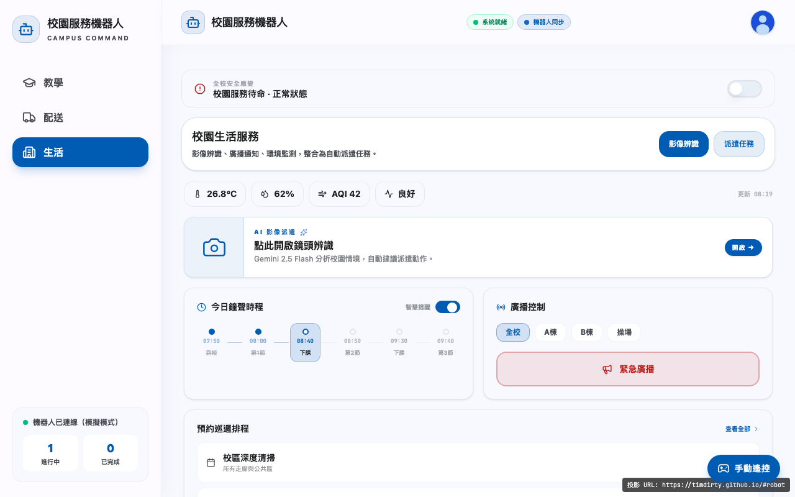

### 路線 C 加分：校園生活 / 影像辨識閉環

**目的**：用相機或範例圖辨識校園情境，轉成清潔、廣播或環境服務任務。

**學生一句話**：我讓機器人看一張校園照片，它會判斷要清潔、廣播還是巡邏。

**按哪裡**

1. 開相機或選範例圖卡。
2. hosted model 失敗時，用同張圖本機 vision 分析。
3. 把結果轉成清潔、廣播或環境任務。
4. 硬體或模擬指令送出後，生活服務紀錄完成。

**AI / 辨識來源**：優先使用 hosted vision；失敗時同張圖改走本機 localVision 場景判斷。

**硬體 / 模擬指令**：`VISION_CLEANING_PATROL`, `VISION_CROWD_BROADCAST`, `VISION_SAFETY_PATROL`, `STOP`

**成功證據**：影像結果、任務類型、派遣 log、生活服務紀錄

**卡關備案**：相機或網路失敗時使用內建範例圖卡與本機 vision，同樣生成任務。

**標註截圖清單**

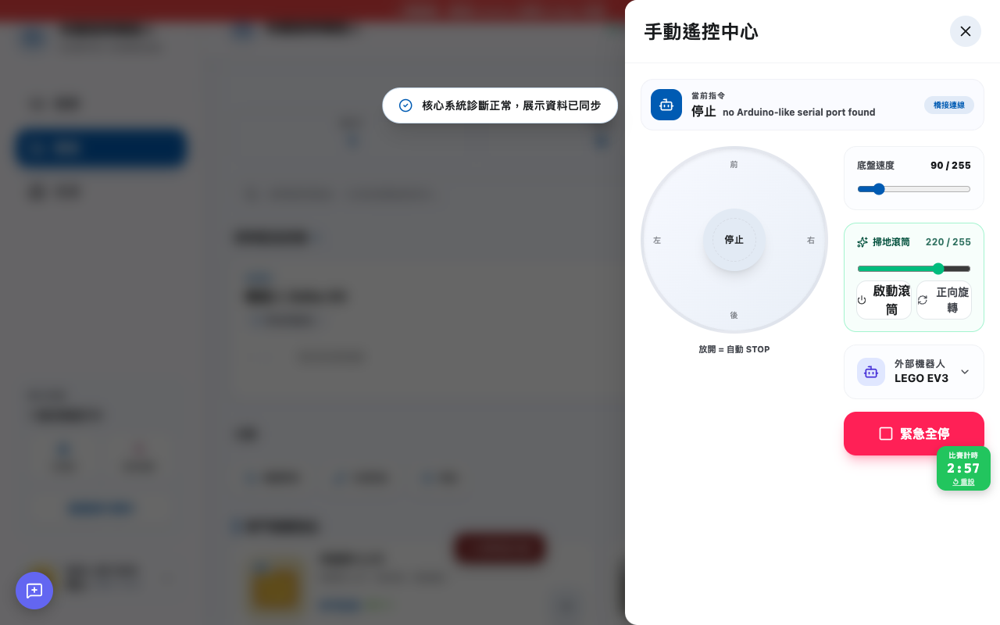

## 國中隊伍 - AI 校園心靈守護者

入口：https://timdirty.github.io/115-campus-ai-demo/app3/
教學頁：https://timdirty.github.io/115-campus-ai-demo/app3-guide.html

### 三位上台分工

- 第一位同學：用「非診斷、匿名、老師確認」說明問題意識與安全邊界。
- 第二位同學：操作主線示範，讓五段閉環從 0/5 跑到 5/5 並建立關懷事件。
- 第三位同學：展示預警、感知、機器人任務與硬體備援紀錄，回答 AI 融合問題。

### 路線 A 主線：心情關懷閉環

**目的**：匿名心情輸入後，由守護 AI 建議低壓回覆，老師確認處理並留下結案時間線。

**學生一句話**：同學匿名說出心情，AI 只提醒需要老師確認，不做診斷，最後留下關懷紀錄。

**按哪裡**

1. 匿名輸入心情或啟動主線示範。
2. 本機守護 AI / Gemini 產生低壓回覆。
3. 建立關懷事件，老師確認處理。
4. 結案時間線留下預警、派遣與照護證據。

**AI / 辨識來源**：本機守護 AI 優先產生安全語氣；Gemini 可選，且遇到危機詞會轉老師確認。

**硬體 / 模擬指令**：`ALERT_SIGNAL`, `EV3_SAFE_POSE`, `EV3_STOP`

**成功證據**：匿名心情、AI 低壓回覆、老師確認、關懷結案時間線

**卡關備案**：沒有 Gemini 或斷網時使用本機守護回覆，仍可建立事件與結案紀錄。

**標註截圖清單**

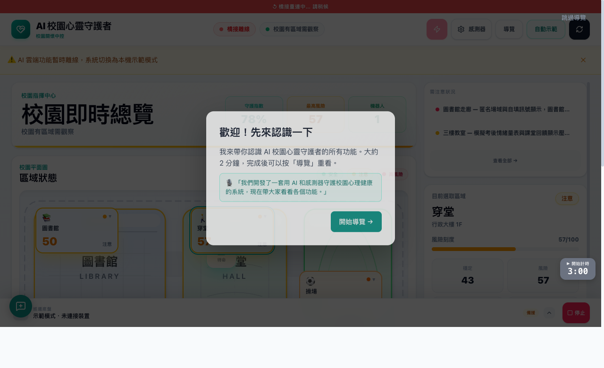

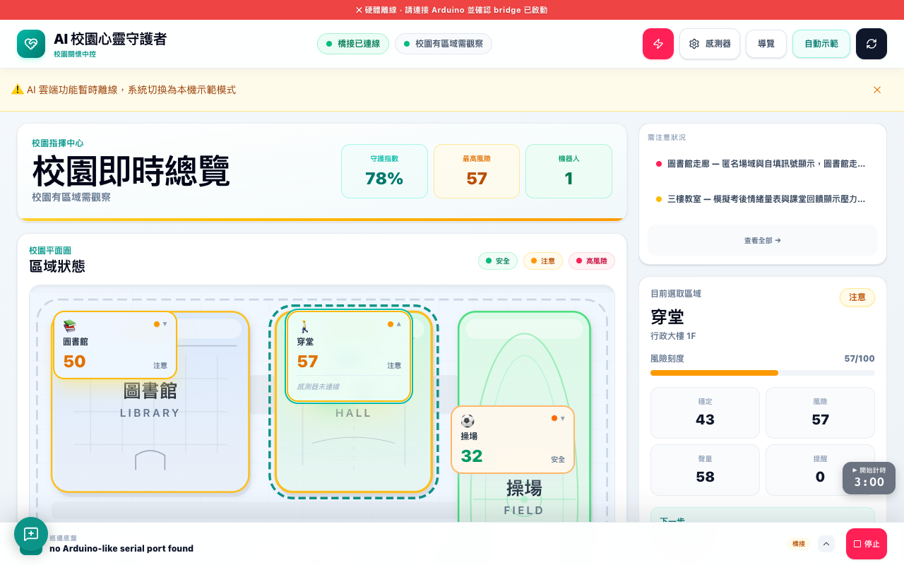

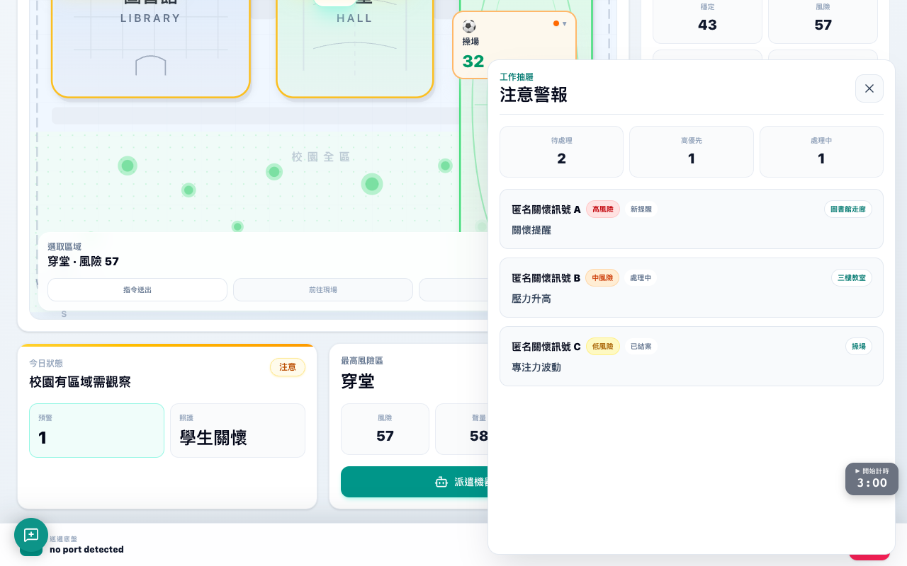

### 路線 B 加分：感測 / 場域預警閉環

**目的**：把 HY-M302、DHT、光敏或模擬感測資料轉成地圖風險提醒與派遣任務。

**學生一句話**：感測器看到場域變化，地圖亮起提醒，老師再決定要不要派機器人。

**按哪裡**

1. 讀取 HY-M302 / DHT / 光敏或模擬感測資料。
2. zone advisor 判斷哪個區域需要注意。
3. 校園地圖亮起風險區，老師派遣機器人或 LED 提示。
4. robot display 與任務狀態回報完成。

**AI / 辨識來源**：zone advisor 使用本機規則與可選 AI 說明，輸出是風險提醒不是診斷。

**硬體 / 模擬指令**：`SENSOR_POLL`, `ALERT_SIGNAL`, `EV3_ARM_EXTEND`, `EV3_SAFE_POSE`, `EV3_STOP`

**成功證據**：感測數值、地圖風險區、派遣任務、robot display 狀態

**卡關備案**：感測器未接時用內建示範資料，保留完整地圖與派遣流程。

**標註截圖清單**

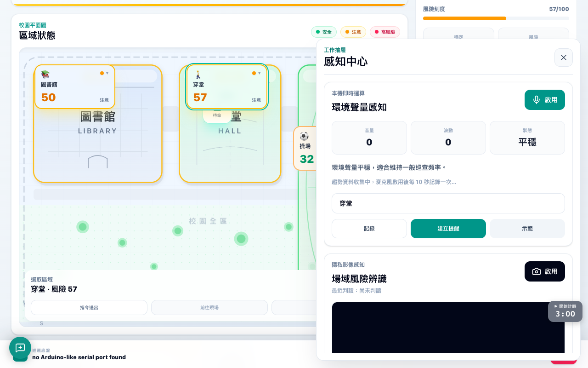

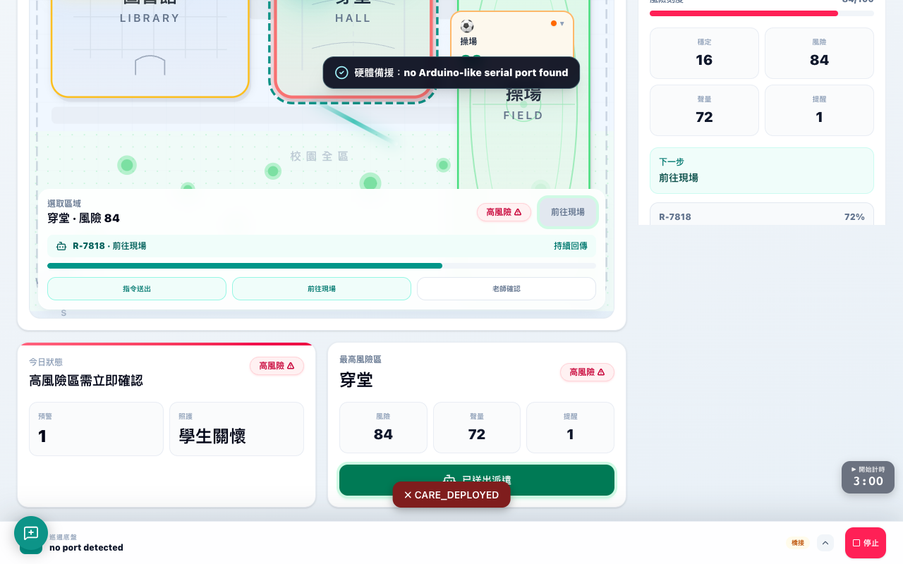

### 路線 C 加分：匿名情境圖卡閉環

**目的**：用匿名圖卡把視覺、聲量與文字線索融合成老師確認提醒。

**學生一句話**：我選一張匿名圖卡，AI 只說需要老師確認，然後派巡邏或通知老師。

**按哪裡**

1. 選一張匿名情境圖卡。
2. 視覺、聲量、文字訊號融合，產生低壓說明。
3. AI 標記需要老師確認，不做心理診斷。
4. 派巡邏或通知老師，關懷紀錄完成。

**AI / 辨識來源**：圖卡使用本機 visual privacy guardian 與示範 acoustic 訊號融合，避免個資與診斷語氣。

**硬體 / 模擬指令**：`ALERT_SIGNAL`, `PATROL_ROUTE`, `EV3_SAFE_POSE`, `EV3_CANCEL`

**成功證據**：匿名圖卡、融合判讀、老師確認提醒、關懷紀錄

**卡關備案**：相機不可用時開啟列印圖卡頁；一樣能用示範資料跑完整閉環。

**標註截圖清單**

